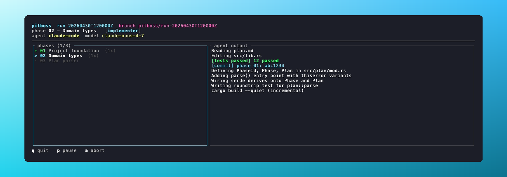
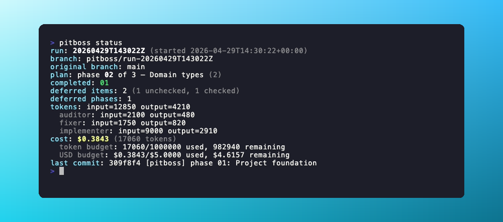
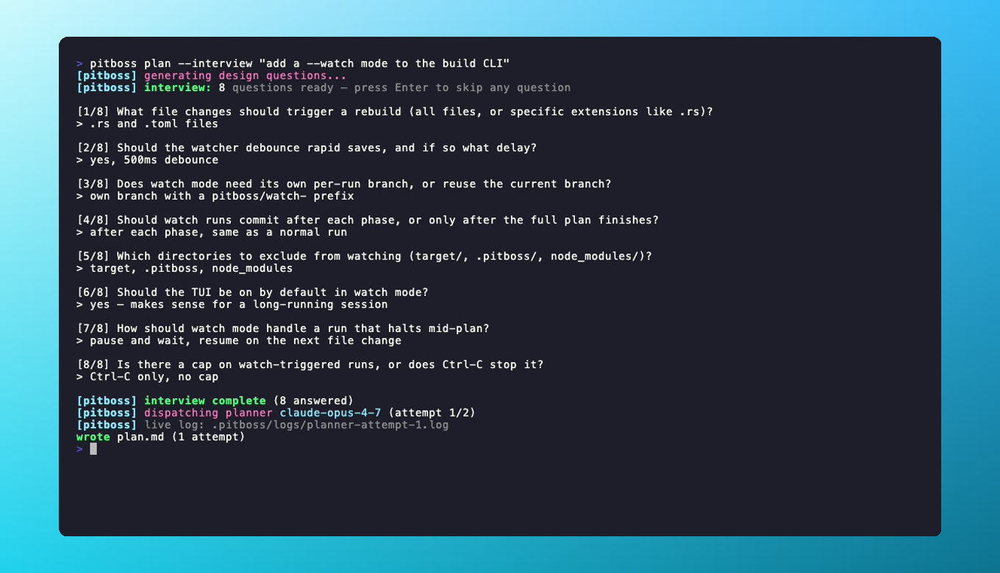
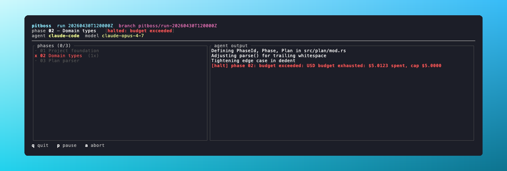

<div align="center">

  


**A coding-agent pitboss.** Hand it a phased plan, walk away, come back to a branch full of green commits.

[](https://www.rust-lang.org)
[](#license)
[](#agent-backends)
[](https://github.com/elicpeter/pitboss/actions/workflows/ci.yml)

</div>

Pitboss is a Rust CLI that drives a coding agent through a multi-phase implementation plan. Claude Code is the default; OpenAI's Codex CLI, Aider, and Gemini CLI are also wired in and selectable from `pitboss.toml` (see [Agent backends](#agent-backends)). It runs your test suite after every phase, retries failures with a fixer agent, audits the diff, lands a commit, then moves on. Bounded retries everywhere. Token and dollar budgets. A live TUI if you want to watch.

<div align="center">
  
</div>
<div align="center">
  <sub align="center"><i>`pitboss run --tui`. The dashboard. Phases on the left, live agent output on the right.</i></sub>
</div>

## Contents

- [How it works](#how-it-works)
- [Install](#install)
- [Quickstart](#quickstart)
- [Generating a plan](#generating-a-plan)
- [The run loop](#the-run-loop)
- [Configuration](#configuration)
- [Agent backends](#agent-backends)
- [Test runner detection](#test-runner-detection)
- [Dry runs and verbose output](#dry-runs-and-verbose-output)
- [Workspace layout](#workspace-layout)
- [Troubleshooting](#troubleshooting)
- [Contributing](#contributing)
- [License](#license)

## How it works

Three files do the work.

| File | Owner | Contents |
|------|-------|----------|
| `plan.md` | you | The phases. Read-only to agents. |
| `deferred.md` | the agent | Anything the agent couldn't finish in a phase. Swept between phases. |
| `.pitboss/state.json` | pitboss | Run id, branch, attempts, token usage. |

Each phase becomes its own commit on a per-run branch, optionally rolled into a pull request when the run finishes.

## Install

A recent stable Rust toolchain is the only build requirement.

```sh
git clone <this repo>
cd pitboss
cargo install --path .
```

To actually drive the agent you also need:

- **`claude`**, the Claude Code CLI from Anthropic. Required for the default backend; optional if you select a different one in `pitboss.toml`.
- **`git`**, any reasonably recent version.
- **`gh`** (optional), only if you want `--pr` to open pull requests.

If you plan to swap backends, install whichever CLI you intend to use instead of (or in addition to) `claude`:

- **`codex`**, only if `[agent] backend = "codex"`. See [Agent backends](#agent-backends).
- **`aider`**, only if `[agent] backend = "aider"`.
- **`gemini`**, only if `[agent] backend = "gemini"`.

## Quickstart

```sh
mkdir my-project && cd my-project
git init
pitboss init                # scaffold plan.md, deferred.md, pitboss.toml, .pitboss/
$EDITOR plan.md             # describe the work, phase by phase
pitboss run --dry-run       # exercise the runner without spending tokens
pitboss run                 # let the agent loop drive the plan
pitboss status              # check progress at any time
```

`pitboss status` looks like this:

<div align="center">
  
</div>

A few entry points worth knowing:

- `pitboss plan "build a CLI todo app in Rust"` has the planner agent draft `plan.md` for you. Add `--interview` to answer design questions first and get a more targeted plan (see [Generating a plan](#generating-a-plan)).
- `pitboss run --tui` swaps the stderr logger for the dashboard above.
- `pitboss run --pr` (or `git.create_pr = true`) opens a pull request with `gh pr create` after the run finishes.
- `pitboss resume` picks up where a halted run left off.
- `pitboss abort --checkout-original` marks the run aborted and switches HEAD back to the branch you were on before `pitboss run`.

## Generating a plan

`pitboss plan "my goal"` calls the planner agent to draft `plan.md`. Give it a plain description of the feature or change; the planner also reads the repo layout, manifests, and README for context.

```sh
pitboss plan "add JSON export to the audit report"
pitboss plan "add JSON export to the audit report" --force   # overwrite an existing plan.md
```

### Interview mode

Pass `--interview` and pitboss runs a design session before calling the planner. The agent generates targeted questions about your goal, asks them one by one in the terminal, and uses your answers to write a more concrete `plan.md`.

```sh
pitboss plan --interview "add a --watch mode to the build CLI"
```

<div align="center">
  
</div>
<div align="center">
  <sub align="center"><i>`pitboss plan --interview`. The agent asks design questions, you answer, then the planner runs with the full context.</i></sub>
</div>

Questions cover things like interface design, data structures, edge cases, and test approach. Press Enter to skip any question you don't want to answer. The Q&A is compiled into a design spec and handed to the planner alongside the goal, so the resulting plan reflects decisions you made up front rather than ones the agent guessed at.

The number of questions varies with the goal; the agent caps at 50.

## The run loop

For each phase in `plan.md`:

1. Snapshot `plan.md` and `deferred.md` (SHA-256).
2. Dispatch the **implementer** agent with the active phase, the unfinished deferred work, and the user prompt template.
3. If the agent modified `plan.md`, restore the snapshot and halt.
4. Re-parse `deferred.md`. On parse failure, restore the snapshot and halt.
5. Run the project test suite. If it fails, dispatch the **fixer** agent up to `retries.fixer_max_attempts` times.
6. Stage the diff and dispatch the **auditor** agent (when `audit.enabled = true`). The auditor inlines small fixes and records anything larger in `deferred.md`. Tests run again post-audit.
7. Commit the staged diff to the per-run branch as `[pitboss] phase <id>: <title>`. `plan.md`, `deferred.md`, and `.pitboss/` are excluded from the commit.
8. Sweep checked-off deferred items, advance `current_phase` in `plan.md`, persist `state.json`, move on.

Every retry is bounded. When a budget is exhausted the runner halts with a clear reason and `pitboss resume` picks up from the same phase.

<div align="center">
  
</div>
<div align="center">
  <sub align="center"><i>USD budget tripped mid-phase. Pitboss halts, no commit lands, `pitboss resume` picks up from phase 02.</i></sub>
</div>

## Configuration

Pitboss reads `pitboss.toml` from the workspace root. Every section is optional, missing keys fall back to defaults. Unknown keys load with a warning so a config written by a newer pitboss still works.

```toml
# Per-role model selection. Strings pass verbatim to the agent (e.g.
# `claude --model <id>`), so they must be valid model identifiers.
[models]
planner     = "claude-opus-4-7"
implementer = "claude-opus-4-7"
auditor     = "claude-opus-4-7"
fixer       = "claude-opus-4-7"

# Bounded retries. No infinite loops.
[retries]
fixer_max_attempts = 2   # 0 disables the fixer entirely
max_phase_attempts = 3

# Auditor pass. ON by default. Disable to commit straight after tests pass.
[audit]
enabled              = true
small_fix_line_limit = 30   # line threshold separating "inline" from "defer"

# Per-run branch and optional PR.
[git]
branch_prefix = "pitboss/run-"   # full branch is <prefix><utc_timestamp>
create_pr     = false            # equivalent to `pitboss run --pr`

# Test runner override. Leave commented to auto-detect.
# [tests]
# command = "cargo test --workspace"

# Cost guard. Either limit being set activates budget enforcement: the
# runner halts before the next dispatch that would exceed the cap.
[budgets]
# max_total_tokens = 1_000_000
# max_total_usd    = 5.00

# Override or extend the default per-model price points. Defaults cover
# claude-opus-4-7, claude-sonnet-4-6, and claude-haiku-4-5.
# [budgets.pricing.claude-opus-4-7]
# input_per_million_usd  = 15.0
# output_per_million_usd = 75.0

# Caveman mode. Off by default. See "Caveman mode" below.
[caveman]
enabled   = false
intensity = "full"   # one of: lite, full, ultra
```

### Per-role model recommendations

The defaults set every role to the latest Opus, which is fine if you don't want to think about it. For a cheaper run, split it like this:

| Role          | Model                | Rationale                                            |
| ------------- | -------------------- | ---------------------------------------------------- |
| `planner`     | `claude-opus-4-7`    | One careful plan up front saves dozens of bad phases. |
| `implementer` | `claude-opus-4-7`    | Most of the spend, most sensitive to capability.     |
| `auditor`     | `claude-sonnet-4-6`  | Diff review and short-form notes. Sonnet handles it. |
| `fixer`       | `claude-sonnet-4-6`  | Test fix-ups are usually small and local.            |

Configure pricing for any model you reference in `[models]` so `pitboss status` and the USD budget check produce accurate numbers.

### Caveman mode

Pitboss can prepend a "talk like caveman" directive to every agent system prompt to cut output tokens. The idea comes from the [caveman skill](https://github.com/JuliusBrussee/caveman): drop articles, filler words, and pleasantries while keeping technical content exact. Output drops by roughly 65 to 75 percent on prose. Code blocks, commit messages, PR descriptions, and the structured `plan.md` and `deferred.md` artifacts stay in their normal format so downstream parsing is not affected.

Off by default. Flip `enabled = true` in the `[caveman]` block above to turn it on. Three intensity levels:

| Level   | What it does                                                                       |
| ------- | ---------------------------------------------------------------------------------- |
| `lite`  | Drops filler and hedging only. Keeps articles and full sentences. Lowest risk.     |
| `full`  | Drops articles too, allows fragments, prefers short synonyms. The skill's default. |
| `ultra` | Heavy abbreviation (DB, auth, fn, impl). Arrows for causality. Most compression.   |

Works on every backend. Claude Code receives the directive via `--append-system-prompt`; Codex and Aider get it concatenated ahead of the user prompt.

One tradeoff worth knowing. The planner, fixer, and auditor each produce output that the next role reads as input. Terser plan and audit prose can lose detail the next role would have used. A reasonable approach is to start with `lite`, watch a run or two, then move up to `full` or `ultra` if the plans and audits still hold up.

## Agent backends

Pitboss dispatches every implementer / fixer / auditor / planner role through a pluggable backend that wraps an external coding-agent CLI. Pick one in `pitboss.toml`:

```toml
[agent]
backend = "claude_code"   # one of: claude_code (default), codex, aider, gemini
```

Each backend has its own optional sub-table for binary path, extra arguments, and a model override that wins over the role-level `[models]` table when set:

```toml
[agent.<backend>]
binary     = "/usr/local/bin/<cli>"   # default: resolve on PATH
extra_args = ["--flag", "value"]      # appended to every invocation
model      = "<model-id>"             # optional, beats [models].<role>
```

Omit `[agent]` entirely and pitboss runs with `claude_code` and PATH-resolved `claude`, same as it always has.

### Claude Code (default)

The reference backend, built on Anthropic's Claude Code CLI. Streams structured JSON events, populates `AgentOutcome` directly from them, and is the only backend that exercises every code path the runner relies on.

- **Binary:** `claude` ([install](https://docs.anthropic.com))
- **Config:**
  ```toml
  [agent]
  backend = "claude_code"

  [agent.claude_code]
  # binary, extra_args, model are all optional
  ```
- **Limitations:** none known.

### OpenAI Codex CLI

Wraps OpenAI's `codex` CLI. The agent concatenates the system and user prompts, pipes them on stdin, and parses the newline-delimited JSON event stream into `AgentOutcome`.

- **Binary:** `codex`
- **Config:**
  ```toml
  [agent]
  backend = "codex"

  [agent.codex]
  model = "gpt-5-codex"
  ```
- **Limitations:** none known.

### Aider

Wraps the `aider` CLI. The phase prompt is delivered via inline `--message <body>`; output parsing keys off Aider's plain-text edit/commit prefixes (`Applied edit to ...`, `Commit ...`).

- **Binary:** `aider`
- **Config:**
  ```toml
  [agent]
  backend = "aider"

  [agent.aider]
  model      = "sonnet"
  extra_args = ["--yes-always", "--map-tokens", "0"]
  ```
- **Limitations:**
  - **No per-phase file-scope auto-discovery.** Aider only edits files added to its chat. Until pitboss grows a per-phase scope mechanism, enumerate the relevant paths yourself via `extra_args = ["--file", "src/foo.rs", "--file", "src/bar.rs"]`.
  - **Prompt size capped by `ARG_MAX`.** The current `--message <body>` argv path is bounded by the OS argument limit (~256 KB on macOS, ~2 MB on Linux). Comfortable today; a future change will switch to `--message-file` for large payloads.

### Gemini CLI

Wraps Google's `gemini` CLI in single-shot JSON-output mode. The phase prompt is passed as `--prompt <body>`; the terminal JSON document is parsed for the response and tool-call summary.

- **Binary:** `gemini`
- **Config:**
  ```toml
  [agent]
  backend = "gemini"

  [agent.gemini]
  model = "gemini-2.5-pro"
  ```
- **Limitations:**
  - **Prompt size capped by `ARG_MAX`.** Same inline-argv exposure as Aider; will be resolved alongside it via a shared inline-vs-stdin helper.
  - **Tool-call ordering is approximate.** Gemini's JSON stats report tool usage as a name → count map, so the dashboard's tool-call list reflects map-iteration order, not the model's actual call sequence. Cosmetic; the run itself is unaffected.

## Test runner detection

The runner probes the workspace in this order and uses the first match:

1. `Cargo.toml` → `cargo test`
2. `package.json` (with a non-empty `scripts.test`) → `pnpm test` / `yarn test` / `npm test` (chosen by lock file)
3. `pyproject.toml` or `setup.py` → `pytest`
4. `go.mod` → `go test ./...`

Unrecognized layouts skip the test step. The runner then advances on a passing implementer dispatch alone. Override detection by setting `[tests] command = "..."`. The value is whitespace-split into program and args, so shell features (pipes, env-var assignments) need an explicit `sh -c "..."` wrapper.

## Dry runs and verbose output

`pitboss run --dry-run` swaps the configured agent for a deterministic no-op and skips test execution. Use it to sanity-check that:

- `plan.md` parses and `current_phase` resolves to a real heading.
- `pitboss.toml` parses cleanly with the keys you expect.
- The per-run branch is created and checked out without touching `main`.
- The event stream and TUI / logger render correctly.

Dry-run advances through every phase, attempts the per-phase commit (which no-ops because nothing was staged), and finishes without any model spend. The post-run PR step is suppressed in dry-run mode regardless of `--pr` / `git.create_pr` so a no-op branch never accidentally opens a PR.

`pitboss -v <command>` lowers the log filter to `debug`. `-vv` lowers it to `trace`. `PITBOSS_LOG` and `RUST_LOG` still take precedence when set, so per-process tuning works without touching the flag.

## Workspace layout

After `pitboss init`:

```
your-project/
├── plan.md              # source of truth for the work
├── deferred.md          # agent-writable, swept between phases
├── pitboss.toml         # config
├── .gitignore           # pitboss appends `.pitboss/` if missing
└── .pitboss/
    ├── state.json       # runner-managed, ignored by git
    ├── snapshots/       # pre-agent snapshots of plan.md and deferred.md
    └── logs/            # per-phase, per-attempt agent and test logs
```

`init` is idempotent. Re-running it on a populated workspace skips every existing file and prints a per-file summary.

## Troubleshooting

<details>
<summary><code>run halted at phase NN: plan.md was modified by the agent</code></summary>

The agent wrote to `plan.md`. Pitboss restored the file from snapshot, your plan is intact. Re-read the phase prompt: it likely needs sharper guard rails about not editing planning artifacts. `pitboss resume` retries the same phase.
</details>

<details>
<summary><code>run halted at phase NN: deferred.md is invalid: ...</code></summary>

The agent wrote a malformed `deferred.md`. Pitboss restored from snapshot. The error message includes a 1-based line number. Check the agent's log under `.pitboss/logs/phase-<id>-implementer-<n>.log` to see what it tried to write.
</details>

<details>
<summary><code>run halted at phase NN: tests failed: ...</code></summary>

The implementer plus fixer dispatches together couldn't get the suite green within the configured budget. The summary includes the trailing lines of the test log; the full transcript is at `.pitboss/logs/phase-<id>-tests-<n>.log`. Either bump `retries.fixer_max_attempts`, fix the failing test by hand, or rework the phase.
</details>

<details>
<summary><code>run halted at phase NN: budget exceeded: ...</code></summary>

`max_total_tokens` or `max_total_usd` was hit before the next dispatch. `pitboss status` shows the running totals and per-role breakdown. Raise the cap (or clear it) and `pitboss resume`.
</details>

<details>
<summary><code>state.json marks run X as aborted; remove .pitboss/state.json to start over</code></summary>

A previous run was aborted with `pitboss abort`. Pitboss keeps the state file as a breadcrumb. Delete `.pitboss/state.json` to start fresh. Everything else (plan, deferred, branch, commits) is preserved.
</details>

<details>
<summary><code>no run to resume: .pitboss/state.json is empty</code></summary>

You called `pitboss resume` on a workspace where no run has started. Use `pitboss run` instead.
</details>

<details>
<summary><code>creating per-run branch ... (workspace must already be a git repo)</code></summary>

The workspace isn't a git repo. `git init` it first. Pitboss won't, on purpose.
</details>

`pitboss --version` prints the pitboss crate version. Useful when filing issues.

## Examples

The [`examples/`](examples) directory contains a walkthrough plan you can copy into a fresh workspace and run end-to-end.

## Contributing

```
src/
├── main.rs          CLI entry, wires the tracing subscriber
├── cli/             clap commands (init, plan, run, status, resume, abort, interview)
├── plan/            Plan/Phase types, parser, snapshot
├── deferred/        DeferredDoc/items/phases, parser
├── state/           RunState, atomic IO
├── config/          pitboss.toml schema and loader
├── agent/           Agent trait, request/outcome, subprocess utils
│   ├── claude_code.rs
│   └── dry_run.rs
├── git/             Git trait, ShellGit, MockGit, PR helpers
├── tests/           project test runner detection (NOT the integration tests)
├── prompts/         system prompt templates
├── runner/          orchestration loop and events
└── tui/             ratatui dashboard
tests/               integration tests
```

## License

MIT OR Apache-2.0.
